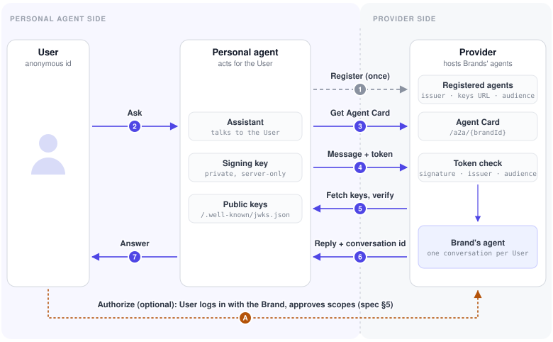

Personal agents increasingly contact Brands on someone's behalf. Today they do
it by driving a chat widget like an anonymous browser: the Brand can't tell
which agent is calling, and the agent can't act on the person's account
without their password.

**Personal Agent Consent & Trust (PACT)** fixes both:

- **Trust** — the agent signs every request, so the Brand knows which agent is
  calling.
- **Consent** — optionally, the User logs in with the Brand and approves
  specific actions. The agent never sees their password.

PACT is a new protocol built on [A2A 1.0](https://a2a-protocol.org).
Everything A2A defines works unchanged.

## Terms

| Term               | Meaning                                                                    | Example                        |
| ------------------ | -------------------------------------------------------------------------- | ------------------------------ |
| **User**           | The person.                                                                | Jane                           |
| **Personal agent** | The agent platform acting for the User.                                    | Jane's assistant app           |
| **Brand**          | A business the User wants help from. Its support agent runs on a Provider. | Loom & Co.                     |
| **Provider**       | Builds and hosts support agents for many Brands.                           | Loom's customer-support vendor |

A personal agent registers with each Provider once, then can talk to every Brand that
Provider hosts.

## How it works

Before the first conversation, the personal agent **registers** once per
Provider: it gives the Provider its issuer URL and public keys (JWKS); the
Provider gives it an `audience` string.

1. **Discovery.** The personal agent fetches the Brand's Agent Card, which says
   where to send messages and, if the Brand offers delegation, which scopes it
   defines (e.g., `orders:read`, `orders:cancel`). The Provider hosts it, e.g.
   `https://provider.example.com/a2a/{brandId}/.well-known/agent-card.json`. The
   personal agent finds that URL through:
   - **Well-known URL** (the standard): the Brand's own domain serves the card or
     redirects to it, e.g. `https://brand.example.com/.well-known/agent-card.json`.
   - **Link or registry**: a link from the Brand, or a public registry of Agent
     Cards, points to the card's URL on the Provider.
2. **Signed request.** The personal agent sends the User's message with a
   short-lived JWT it signed itself; the JWT carries a stable, anonymous id for
   the User. The Provider checks the signature against the personal agent's
   JWKS, and the Brand's agent answers with a `contextId` that the personal
   agent sends with later messages to continue the conversation.
3. **Consent without credentials** _(optional, if the Brand offers it)_. The User
   signs in on the Brand's own login page, never with the agent, then approves
   each scope individually.
4. **Scoped, short-lived token.** The personal agent receives a delegation token
   naming the User, the agent, the Brand, and the granted scopes.
5. **Act for the User.** The personal agent sends the token with its JWT, and
   the Brand's agent acts on the User's account within the granted scopes.

Without steps 3–5, the Brand's agent knows _which personal agent_ is calling,
not _who the User is_, and asks in the conversation (order number, email).

## Start here

- Building a personal agent → [Build a personal agent integration](personal-agent.md)
- Building a Provider → [Build a Provider](provider.md)
- The rules → [Specification](spec.md) (the only normative document)
- Try it → [Run the reference stack](running.md)
