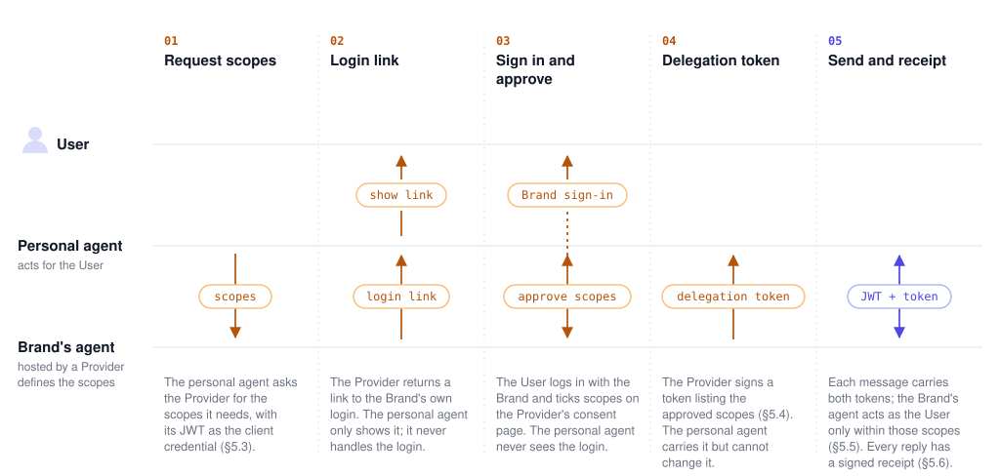

PACT adds two things to [A2A 1.0](https://a2a-protocol.org): a verifiable
identity for the personal agent sending each request ([§3](#3-personal-agent-identity)), and, optionally,
permissions the User grants it on their Brand account ([§5](#5-delegated-authority)). Transport, messages
and errors follow A2A.

The key words MUST, MUST NOT, SHOULD and MAY are to be interpreted as described
in [RFC 2119](https://www.rfc-editor.org/rfc/rfc2119).

## 1. Terms

| Term               | Meaning                                                                                                                                                       |
| ------------------ | ------------------------------------------------------------------------------------------------------------------------------------------------------------- |
| **Provider**       | Builds and hosts Brands' support agents. Serves Agent Cards, verifies tokens, answers messages.                                                               |
| **Brand**          | A business whose agent runs on a Provider. Has a Provider-assigned `brandId`.                                                                                 |
| **Personal agent** | An agent platform acting for the User. Has a signing key and publishes its public keys as a JWKS. Abbreviated `PA`/`pa` in identifiers (`paJwt`, `<pa-jwt>`). |
| **User**           | The person using the personal agent.                                                                                                                          |

| Section                    | Required?                              | Adds                                                                                  |
| -------------------------- | -------------------------------------- | ------------------------------------------------------------------------------------- |
| §2 Transport               | yes                                    | Where a Brand's Agent Card is; which A2A operations exist.                            |
| §3 Personal-agent identity | yes                                    | The bearer token is a JWT the personal agent signs; the Provider checks its JWKS.     |
| §4 Messages                | yes                                    | One `contextId` per (personal agent, User, Brand); retries are idempotent.            |
| §5 Delegated authority     | no — a Brand advertises it on its card | The User logs in with the Brand and approves scopes; the agent acts on their account. |

## 2. Transport

A2A 1.0 HTTP+JSON. Requests SHOULD send `A2A-Version: 1.0` and
`Content-Type: application/json`. A2A responses MUST use
`Content-Type: application/a2a+json`.

### 2.1 Agent Card

One card per Brand, served by the Provider:

```http
GET {PROVIDER_URL}/a2a/{brandId}/.well-known/agent-card.json
```

- The personal agent gets the card URL from the Brand; it never builds it from
  a Brand ID. The standard place is
  `https://{brandDomain}/.well-known/agent-card.json`, which serves the card or
  redirects to the Provider's URL. Out-of-band sources, such as a link from the
  Brand or a public registry of Agent Cards, MAY point to the card wherever it
  is hosted. This spec does not define a registry.
- No authentication. An unknown `brandId` gets `404` with no A2A body.
- MUST list a `supportedInterfaces` entry with `protocolBinding: "HTTP+JSON"`
  and `protocolVersion: "1.0"`. Its `url` is the **interface URL**. Personal agents pick
  the interface by binding and version, not by position.
- MUST declare the personal-agent JWT (§3) as an `httpAuthSecurityScheme` with
  `scheme: "Bearer"`, `bearerFormat: "JWT"`, listed alone in one
  `securityRequirements` entry.
- MAY declare delegated authority (§5.1).
- `capabilities.streaming`, `pushNotifications`, and `extendedAgentCard` MUST
  be `false`. `name`, `description`, `skills` are informational.

```json
{
  "name": "Example Co. Support",
  "supportedInterfaces": [
    {
      "url": "https://provider.example.com/a2a/01J…",
      "protocolBinding": "HTTP+JSON",
      "protocolVersion": "1.0"
    }
  ],
  "provider": { "organization": "Example Provider", "url": "https://provider.example.com" },
  "version": "0.1.0",
  "capabilities": { "streaming": false, "pushNotifications": false, "extendedAgentCard": false },
  "securitySchemes": {
    "paJwt": { "httpAuthSecurityScheme": { "scheme": "Bearer", "bearerFormat": "JWT" } }
  },
  "securityRequirements": [{ "schemes": { "paJwt": { "list": [] } } }],
  "defaultInputModes": ["text/plain"],
  "defaultOutputModes": ["text/plain"],
  "skills": [
    {
      "id": "orders",
      "name": "Orders",
      "description": "Order status and changes.",
      "tags": ["orders"]
    }
  ]
}
```

### 2.2 Operations

Relative to the interface URL. Only `message:send` does work; the others
return A2A errors so generic A2A clients fail cleanly.

| Method          | Path                                            | Result                                                           |
| --------------- | ----------------------------------------------- | ---------------------------------------------------------------- |
| `POST`          | `message:send`                                  | `200` `{ "message": Message }` (§4) or `{ "task": Task }` (§5.5) |
| `GET`           | `tasks`                                         | `200` empty `ListTasksResponse` (`pageSize` 1–100, default 50)   |
| `GET`           | `tasks/{id}`                                    | `TASK_NOT_FOUND`                                                 |
| `POST`          | `tasks/{id}:cancel`                             | `TASK_NOT_FOUND`                                                 |
| `POST`          | `tasks/{id}:subscribe`, `message:stream`        | `UNSUPPORTED_OPERATION`                                          |
| `GET`           | `extendedAgentCard`                             | `UNSUPPORTED_OPERATION`                                          |
| `GET`, `POST`   | `tasks/{id}/pushNotificationConfigs`            | `PUSH_NOTIFICATION_NOT_SUPPORTED`                                |
| `GET`, `DELETE` | `tasks/{id}/pushNotificationConfigs/{configId}` | `PUSH_NOTIFICATION_NOT_SUPPORTED`                                |

Any other route gets `404` or `405` with no A2A body. Routing happens before
authentication; an unknown Brand is `404` even with a valid token.

## 3. Personal agent identity

The bearer token is a JWT the personal agent signs with its own key. The Provider
verifies it against the personal agent's JWKS. No shared secrets.

### 3.1 Onboarding

| Kept by        | Value      | Rule                                                                                           |
| -------------- | ---------- | ---------------------------------------------------------------------------------------------- |
| Provider       | `issuer`   | URL the personal agent puts in `iss`. Exact string match.                                      |
| Provider       | `jwksUri`  | HTTPS URL of the personal agent's JWKS. Rotate keys by publishing new ones; the URI is stable. |
| Provider       | enabled    | Providers MAY disable a personal agent; its requests then get `401`.                           |
| Personal agent | `audience` | Opaque string the Provider assigns. Goes in `aud` verbatim.                                    |

How these are exchanged is out of scope. Onboarding happens once per personal agent and
Provider, not per User or Brand. `audience` is one value per Provider and
MUST NOT be derived from a card URL.

Whether a Provider accepts only personal agents it has allowlisted (a trusted-issuer
registry) or any personal agent whose `iss` serves a JWKS is the Provider's policy, not
PACT's. An open Provider still verifies §3.2 in full; `jwksUri` MAY then be
found through OIDC discovery at `{iss}/.well-known/openid-configuration`.

### 3.2 Personal-agent JWT

Every request except the card carries `Authorization: Bearer <pa-jwt>`.

| Field | Rule                                                                           |
| ----- | ------------------------------------------------------------------------------ |
| `alg` | `ES256` or `RS256`. Providers MUST reject others.                              |
| `kid` | SHOULD match a key in the JWKS.                                                |
| `iss` | MUST equal the registered issuer.                                              |
| `sub` | MUST be present. Stable, opaque, per User. MUST NOT contain personal data.     |
| `aud` | MUST equal the assigned audience. One string.                                  |
| `iat` | MUST be present. Reject if more than 30 s in the future.                       |
| `exp` | MUST be present. SHOULD be short (the reference signer uses 120 s, max 300 s). |
| `jti` | MAY be present. Providers need not track replay.                               |

Providers MUST verify the signature via `jwksUri`, allow at most 30 s clock
skew, and reject unknown or disabled personal agents. The User is the pair `(personal agent, sub)`;
the personal agent MUST reuse the same `sub` for the same User.

### 3.3 What the personal-agent JWT proves

That a known personal agent is calling for someone it calls `sub`. Not that `sub` owns a
Brand account. Without §5, the agent verifies the User the way it does in a
chat widget — it asks for an order number, email, etc. — and the personal agent relays the
User's answers. Account credentials never pass through the personal agent.

### 3.4 Failure

```http
HTTP/1.1 401 Unauthorized
WWW-Authenticate: Bearer realm="a2a"
```

For every authentication failure. No A2A body. Providers SHOULD authenticate
before looking up the Brand or reading the body.

## 4. Messages

```http
POST {interfaceUrl}/message:send
Authorization: Bearer <pa-jwt>
A2A-Version: 1.0
Content-Type: application/json

{ "message": { "messageId": "m-001", "role": "ROLE_USER", "parts": [{ "text": "I need help with my order." }] } }
```

```json
{
  "message": {
    "messageId": "r-001",
    "contextId": "f0c12e6b-231e-4d92-a610-2518a0f27d20",
    "role": "ROLE_AGENT",
    "parts": [{ "text": "Sure — what is the order number?" }]
  }
}
```

### 4.1 Request

- An A2A `SendMessageRequest`. `configuration` and `metadata` MAY be ignored.
- `role` MUST be `ROLE_USER`. `parts` MUST have at least one non-blank `text`
  part. Other part kinds get `CONTENT_TYPE_NOT_SUPPORTED`.
- `taskId` MUST be absent; otherwise `TASK_NOT_FOUND`.
- `messageId` MUST be unique within the context.

### 4.2 Context

- The reply is synchronous: `{ "message": Message }` with `role: ROLE_AGENT`
  and `contextId` set (or a task, §5.5).
- Without `contextId`, the message starts a new conversation and the Provider
  mints an opaque `contextId`.
- With `contextId`, the message continues that conversation. The context MUST
  belong to this Brand and this `(personal agent, sub)`; otherwise
  `INVALID_PARAMS`, without saying whether it exists for someone else.
- `contextId` is state, not a credential. Ordinary turns create no A2A Task.
- A Provider MAY close a conversation (the Brand's agent ended it, or it
  expired). A message to a closed `contextId` gets `UNSUPPORTED_OPERATION`;
  the personal agent starts a new conversation by omitting `contextId`.

### 4.3 Retries

A repeated `messageId` in the same `contextId` returns the stored reply
without re-running the agent. If there is no stored reply yet, return
`INVALID_PARAMS`.

## 5. Delegated authority

> **Optional.** This is the **PACT Delegated** profile ([§7](#7-conformance)).
> Identity (§2–4) works without it; Providers that don't offer it omit §5.1
> from their cards.

Lets the Brand's agent act on the User's Brand account, using standard OAuth
2.0 device code ([RFC 8628](https://www.rfc-editor.org/rfc/rfc8628)). Each
Brand defines its own scopes. The User logs in with the Brand, never with the
personal agent, and approves some of them. The personal agent needs only a
generic device-code client.

In OAuth 2.0 terms:

| OAuth 2.0             | PACT                                                                                   |
| --------------------- | -------------------------------------------------------------------------------------- |
| Client                | Personal agent. `client_id` is its issuer URL.                                         |
| Client registration   | Onboarding (§3.1): `issuer`, `jwksUri`, assigned `audience`.                           |
| Client authentication | Personal-agent JWT as `Authorization: Bearer`, on every call including the token call. |
| Resource owner        | User — `sub` in the personal-agent JWT; the Brand's own user id in a delegation token. |
| Authorization server  | Provider, per Brand. The login step is the Brand's own login.                          |
| Server metadata       | Agent Card, which links RFC 8414 metadata when the Brand offers delegation.            |
| Scopes                | Defined by each Brand and listed on its card.                                          |
| Access token          | Delegation token, sent in `X-A2A-User-Delegation` next to the personal-agent JWT.      |
| Resource server       | The Brand's agent, behind the interface URL.                                           |



1. The personal agent requests scopes from the card ([§5.3](#53-getting-a-token)).
2. The Provider returns a login link.
3. The personal agent shows the link to the User.
4. The User logs in with the Brand and approves scopes on the Provider's
   consent page. The personal agent never sees the login.
5. The Provider signs a delegation token listing the approved scopes
   ([§5.4](#54-delegation-token)). The personal agent carries it but cannot
   change it.
6. The personal agent sends it with each message. The Provider checks it, and
   the Brand's agent acts as the User only within those scopes
   ([§5.5](#55-sending-with-it)).
7. Every reply carries a signed receipt ([§5.6](#56-receipts)).

### 5.1 Card

A Brand that supports delegation adds an `oauth2SecurityScheme` with a
`deviceCode` flow and a second `securityRequirements` entry naming both
schemes:

```json
{
  "securitySchemes": {
    "paJwt": { "httpAuthSecurityScheme": { "scheme": "Bearer", "bearerFormat": "JWT" } },
    "userDelegation": {
      "oauth2SecurityScheme": {
        "flows": {
          "deviceCode": {
            "deviceAuthorizationUrl": "https://provider.example.com/a2a/01J…/oauth/device_authorization",
            "tokenUrl": "https://provider.example.com/a2a/01J…/oauth/token",
            "scopes": {
              "orders:read": "Look up your orders and their status",
              "orders:cancel": "Cancel an order that has not shipped"
            }
          }
        },
        "oauth2MetadataUrl": "https://provider.example.com/a2a/01J…/oauth/.well-known/oauth-authorization-server"
      }
    }
  },
  "securityRequirements": [
    { "schemes": { "paJwt": { "list": [] } } },
    { "schemes": { "paJwt": { "list": [] }, "userDelegation": { "list": [] } } }
  ]
}
```

- The entry that needs only the personal-agent JWT MUST stay. A personal agent MAY always talk with §3 alone.
- `oauth2MetadataUrl` MUST serve [RFC 8414](https://www.rfc-editor.org/rfc/rfc8414)
  metadata; its `jwks_uri` publishes the keys that sign delegation tokens and
  receipts.

### 5.2 Scopes

A scope is `{ id, description }`. Each Brand defines its own — `orders:read`,
`booking:change`, whatever its agent does — and PACT reserves no ids. The
Brand maps its agent's capabilities to scopes; unmapped capabilities stay
available under §3. Personal agents pick scopes by reading the descriptions and MUST
request only ids on the card. Providers show descriptions to the User
verbatim on consent.

### 5.3 Getting a token

RFC 8628 with two rules: the OAuth client is the personal agent, authenticated with its
§3 JWT (`client_id` = its issuer URL); the login step is the Brand's own login.

```http
POST {deviceAuthorizationUrl}
Authorization: Bearer <pa-jwt>
Content-Type: application/x-www-form-urlencoded

client_id=https://pa.example.com&scope=orders:read%20orders:cancel
```

```json
{
  "device_code": "dc_9f3c…",
  "user_code": "WDJB-MJHT",
  "verification_uri": "https://brand.example/login?return_to=…",
  "verification_uri_complete": "https://brand.example/login?return_to=…user_code%3DWDJB-MJHT",
  "expires_in": 600,
  "interval": 5
}
```

- An unknown scope id gets OAuth `invalid_scope`. A bad personal-agent JWT gets `401` (§3.4).
- The personal agent shows the User `verification_uri_complete`. It MUST NOT proxy, frame,
  or observe the login.
- The link opens the Brand's login. The Brand authenticates the User and
  redirects back to the Provider with an identity assertion (whatever it
  already uses for its other channels; out of scope here). The Provider then
  shows consent as the logged-in User: which personal agent, which Brand, each scope as a
  checkbox the User MAY uncheck. Login comes first so the grant is bound to a
  verified account.
- Consent MAY be skipped when an unexpired grant for `(User, personal agent)` already
  covers the request.

```http
POST {tokenUrl}
Authorization: Bearer <pa-jwt>
Content-Type: application/x-www-form-urlencoded

grant_type=urn:ietf:params:oauth:grant-type:device_code&device_code=dc_9f3c…&client_id=https://pa.example.com
```

Until approval: `authorization_pending`, `slow_down`, `access_denied`, or
`expired_token` per RFC 8628. Then:

```json
{
  "token_type": "Bearer",
  "access_token": "eyJ…",
  "refresh_token": "rt_…",
  "expires_in": 3600,
  "scope": "orders:read orders:cancel"
}
```

`scope` is what the User approved, which may be less than requested. The personal agent
MUST read it.

### 5.4 Delegation token

`access_token` is a JWT signed by the Provider (`ES256`/`RS256`; keys at the
`jwks_uri` from §5.1).

| Claim        | Meaning                                                                                       |
| ------------ | --------------------------------------------------------------------------------------------- |
| `iss`        | The Brand's authorization server (as in its RFC 8414 metadata).                               |
| `aud`        | The Brand's interface URL. One Brand per token.                                               |
| `sub`        | The User's id at the Brand — the same id the Brand's other channels use.                      |
| `client_id`  | The personal agent's issuer URL. MUST equal the `iss` of the personal-agent JWT sent with it. |
| `scope`      | Space-separated granted scope ids.                                                            |
| `grant_id`   | Opaque id of the grant. Appears in receipts.                                                  |
| `iat`, `exp` | Lifetime SHOULD be ≤ 1 h. Refresh within the grant's lifetime.                                |

### 5.5 Sending with it

Both tokens go on the request. The personal-agent JWT is checked first, unchanged.

```http
POST {interfaceUrl}/message:send
Authorization: Bearer <pa-jwt>
X-A2A-User-Delegation: Bearer <delegation-token>
A2A-Version: 1.0
Content-Type: application/json
```

The Provider MUST (1) verify the personal-agent JWT (§3.2); (2) verify the delegation
token's signature, `aud`, `exp`, that `client_id` equals the personal agent's `iss`, and
that the grant is not revoked; (3) run the agent as Brand user `sub`, limited
to `scope`. A bad delegation token gets `401` with
`WWW-Authenticate: Bearer realm="a2a", error="invalid_token"`, no A2A body.

`contextId` rules (§4.2) are unchanged. A context started under §3 MAY
continue under delegation. Once a context has run as one `sub`, a token for a
different `sub` gets `INVALID_PARAMS`.

**Step-up.** If a turn needs a scope the token lacks, the Provider MUST NOT
fail it. It returns a task in `TASK_STATE_AUTH_REQUIRED` with the missing ids
and a new link; the conversation stays open:

```json
{
  "task": {
    "id": "t-01J…",
    "contextId": "f0c12e6b-…",
    "status": {
      "state": "TASK_STATE_AUTH_REQUIRED",
      "message": {
        "role": "ROLE_AGENT",
        "parts": [{ "text": "I need permission to issue refunds." }]
      }
    },
    "metadata": {
      "pact.missingScopes": ["refunds:issue"],
      "pact.verificationUriComplete": "https://brand.example/login?return_to=…"
    }
  }
}
```

The personal agent repeats §5.3 for the missing scopes (login is skipped if the User's
session with the Provider is still live), gets a new token, and re-sends with
the same `contextId`. The step-up task MAY be ephemeral; `tasks/{id}` MAY
return `TASK_NOT_FOUND` for it.

### 5.6 Receipts

Every `message:send` served under a delegation token MUST include in the
reply's `metadata` a receipt signed with the same keys as the token:

```json
{
  "message": {
    "messageId": "r-002",
    "contextId": "f0c12e6b-…",
    "role": "ROLE_AGENT",
    "parts": [{ "text": "Order #A-88213 is cancelled. Refund posts in 3–5 days." }],
    "metadata": {
      "pact.receipt": {
        "jws": "eyJ…",
        "claims": {
          "grantId": "a2agrant_…",
          "user": "jane-4471",
          "pa": "https://pa.example.com",
          "brand": "https://provider.example.com/a2a/01J…",
          "scopesUsed": ["orders:read", "orders:cancel"],
          "actions": [{ "tool": "lookup_orders" }, { "tool": "cancel_order", "argsHash": "…" }],
          "ts": "2026-09-30T12:00:00Z"
        }
      }
    }
  }
}
```

`jws` is the compact JWS of `claims`. Personal agents SHOULD verify and keep receipts.

## 6. Errors

A2A errors use the A2A / AIP-193 envelope. `code` repeats the HTTP status; the
reason is `error.details[0].reason`. Clients MUST NOT infer the reason from
the status alone.

```json
{
  "error": {
    "code": 400,
    "status": "INVALID_ARGUMENT",
    "message": "Unknown contextId",
    "details": [
      {
        "@type": "type.googleapis.com/google.rpc.ErrorInfo",
        "reason": "INVALID_PARAMS",
        "domain": "a2a-protocol.org"
      }
    ]
  }
}
```

| Reason                            | HTTP | `status`              | When                                                |
| --------------------------------- | ---: | --------------------- | --------------------------------------------------- |
| `INVALID_PARAMS`                  |  400 | `INVALID_ARGUMENT`    | Invalid request (see below)                         |
| `CONTENT_TYPE_NOT_SUPPORTED`      |  400 | `INVALID_ARGUMENT`    | Non-text part                                       |
| `UNSUPPORTED_OPERATION`           |  400 | `FAILED_PRECONDITION` | Streaming, subscribe, extended card, closed context |
| `PUSH_NOTIFICATION_NOT_SUPPORTED` |  400 | `FAILED_PRECONDITION` | Push-notification routes                            |
| `TASK_NOT_FOUND`                  |  404 | `NOT_FOUND`           | Task lookup or cancel; `taskId` on `message:send`   |
| `INTERNAL`                        |  500 | `INTERNAL`            | Provider failure                                    |

`INVALID_PARAMS` covers: bad JSON or schema, wrong role, blank text, bad
`pageSize`, an unknown or foreign `contextId`, a repeated `messageId` with no
stored reply, and a `sub` mismatch (§5.5).

Not A2A errors: `401` (§3.4, §5.5); `404`/`405` for unmatched routes or
unknown Brands (§2.2); `429` with `Retry-After` when a Provider rate-limits a
personal agent or a `(personal agent, sub)`; and OAuth endpoint errors
([RFC 6749 §5.2](https://www.rfc-editor.org/rfc/rfc6749#section-5.2), RFC 8628).
On `429`, personal agents SHOULD wait `Retry-After` before retrying.

## 7. Conformance

| Profile            | Sections         |
| ------------------ | ---------------- |
| **PACT Identity**  | §2, §3, §4, §6   |
| **PACT Delegated** | Identity plus §5 |

This is PACT **1.0**. Breaking changes to either profile bump that number.

### 7.1 Implementing

Step-by-step guides with a check per step: [Build a Provider](provider.md)
(ends with running `e2e/` against yourself with `E2E_PROVIDER=any`) and
[Build a personal agent integration](personal-agent.md).
